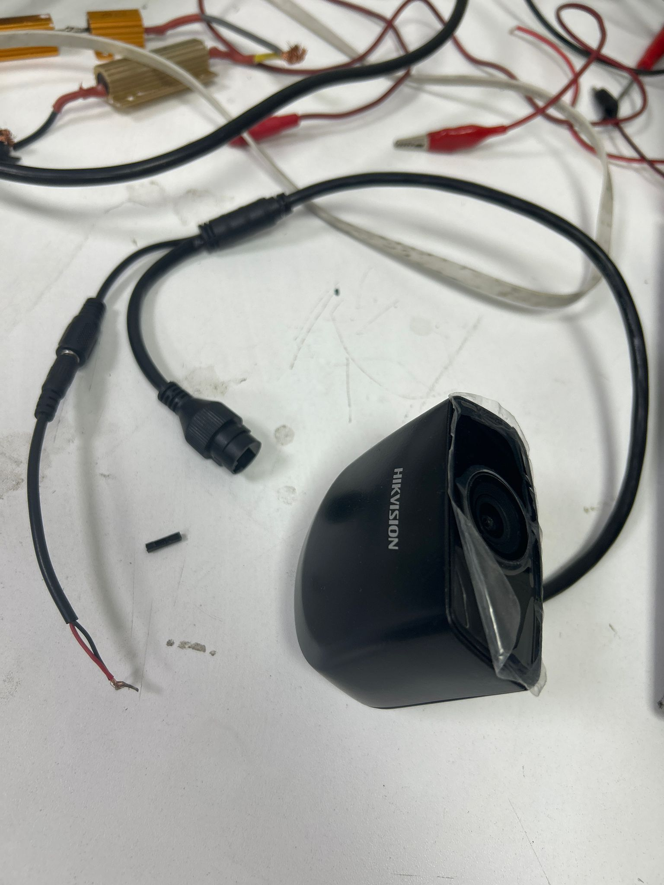

# Environment-perception-and-image-processing-with-YOLO11
YOLO11 object detection integration using a Hikvision RTSP camera or webcam.

Bu proje, AI ile görüntü işleme ve algılama işlemlerini yapar. Sistem, bir Hikvision IP kameradan gelen RTSP akışını asenkron (iş parçacıklı) bir yapıyla alarak gecikmeyi (lag) sıfıra indirir ve YOLO11 (Ultralytics) yapay zeka modeliyle çerçeve kaybı yaşanmadan nesne tespiti yapar.

## 1. Donanım ve Ağ Kurulumu



Görüntü işleme sürecinin kayıpsız gerçekleşmesi için donanım bağlantılarının ve ağ geçitlerinin doğru yapılandırılması gereklidir.

### 1.1. Fiziksel Bağlantı
* Kameranın DC güç girişine pigtail adaptör aracılığıyla **12V DC** güç kaynağı bağlanmalıdır. (Kırmızı kablo: Pozitif +, Siyah kablo: Negatif/GND -).
* Kameranın RJ45 Ethernet portundan çıkan CAT5/CAT6 kablosu doğrudan bilgisayarın veya araç üzerindeki uç işlemcinin (edge AI) Ethernet portuna takılır.

### 1.2. Ağ Yapılandırması ve Statik IP
Kamera varsayılan olarak statik `192.168.4.3` IP adresine ayarlanmıştır. İletişimin kurulabilmesi için işlemi yapan bilgisayarın aynı alt ağa (subnet) alınması gerekir:
1. Windows'ta **Ağ Bağlantıları** ayarlarından Ethernet adaptörünün **IPv4** özelliklerini açın.
2. Bilgisayara şu statik değerleri atayın:
   * **IP Adresi:** `192.168.4.10`
   * **Alt Ağ Maskesi:** `255.255.255.0`

### 1.3. İletişim Doğrulaması (Ping Testi)
Donanım ve IP ayarlarının çalıştığından emin olmak için terminal (CMD) üzerinden kameraya sürekli bir ICMP paketi gönderin:
```bash
ping 192.168.4.3 -t
Not: Kesintisiz bir şekilde "Reply from 192.168.4.3: bytes=32 time<1ms TTL=64" yanıtı alınmalıdır.


2. Geliştirme Ortamı ve Kütüphane Kurulumu
Proje bağımlılıklarını izole etmek için Miniconda kullanılmıştır.

2.1. Miniconda Kurulumu
Miniconda resmi sitesinden Python 3.10 veya üstü sürümü içeren yükleyiciyi indirin ve kurun.

Kurulum sırasında Windows terminal entegrasyonu için "Add Miniconda to my PATH" seçeneğini işaretleyin.

2.2. Sanal Ortam (Conda Environment) Oluşturma
VS Code terminalini (veya Anaconda Prompt) açarak projeye özel yalıtılmış bir ortam oluşturun ve aktif edin:


conda create -n yolo_env python=3.10 -y
conda activate yolo_env

2.3. Gerekli Kütüphanelerin Yüklenmesi
Nesne tespiti için Ultralytics YOLO mimarisi ve görüntü işleme süreçleri için OpenCV kütüphaneleri aynı terminal üzerinden yüklenir:


pip install ultralytics opencv-python

3. Projenin Çalıştırılması
VS Code içerisinde aktif edilen yolo_env ortamı ile ana görüntü işleme betiğini başlatın:

python main.py
İlk çalıştırmada YOLO11 nano (yolo11n.pt) ağırlık dosyası otomatik olarak proje dizinine indirilecektir.

4. Kaynak Kod (main.py) Özellikleri
Sistem, RTSP kaynaklı darboğazları (buffer overflow) ve görüntü gecikmelerini önlemek için özel asenkron optimizasyonlar içerir:

TCP Transport: Ağ stabilitesi için OpenCV paketleri UDP yerine TCP ile okumaya zorlanır.

Threading (Asenkron Okuma): Kameradan gelen kareler (frame), yapay zeka çıkarım (inference) döngüsünden bağımsız ayrı bir arka plan iş parçacığında grab() metoduyla yakalanır.

Confidence Tuning: Hatalı nesne tespitlerini (false-positive) engellemek adına modelin güven eşiği %60 (0.6) olarak yapılandırılmıştır.